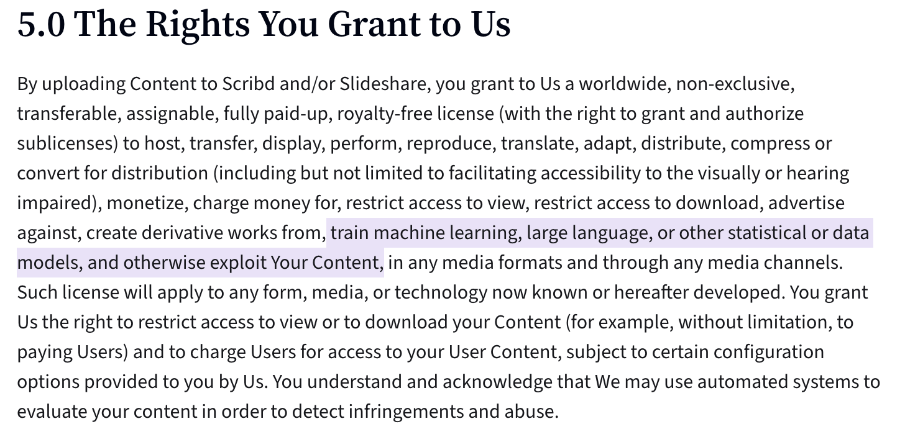

# scribd_file_gen.py
v0.1.0 initial upload.

v0.2.0 added argparse, folder generation/selection/clean

v0.3.1 documentation update. removed folder-clean function.

## about

a few years ago, i noticed that any time i wanted to download a file off of Scribd, they would be begging for you to upload a few files *first* (with some strange reccomendations/requirements) or instead pay a ridiculous cost of $12 a month (after the obligatory free month!!). i uploaded a few files that i had, and upon scribd telling me that those files were already on scribd and therefore not eligible, it became glaringly obvious to me that scribd was begging for any and every text-based file it could get its hands on... so that it could use it all as material for LLMs to scrape data from. this information is not made clear on the upload page, and is instead buried in the "Uploader Agreement", as shown below.



those who know me know how I feel about AI data scraping, especially with such a predatory model. it's as if they're holding a gun to your head saying, "either pay us money, or give us even more of your data to scrape." sure, maybe calling the downloading of some sheet music a gun to one's head is a bit of an overexaggeration, but that's how it feels in regards to the current AI-bubble-driven climate.

today (the date of the inital commit), i had to download another file and it appears that they now require less files, but longer files. i figured now was a good as time as any to upload this to a public repository for others to use. it's also probably nice to have on a public portfolio.

## usage

you can simply run
```
python3 scribd_file_gen.py
```
and the script will dunk 3 .txt files, each 2800 characters in length (as of writing, scribd requires 3 files 2700 in length) into a folder titled /generated-files/ next to the script itself.

### options
---
(v0.3.1)

the script has three command line arguments:

> `-l` `--length` `--filelength`

this designates the character length of the output file. defaults to 2800.

> `-c` `--count` `--filecount`

tells the script how many files to output. useful if you want more or less files of garbage i suppose. default is set to 3 files.

> `-f` `--outputfolder`

designates the location for the output files to be placed. this defaults to a folder called `/generated-files/` next to the script itself. if the folder does not exist, the script creates it.


as an example, the below command would output 5 files of length 3000 characters, in a folder /botpoison/ next to where the script is located.

```
python3 scribd_file_gen.py -l 3000 -c 5 -f botpoison
```


### todo
---
- unique filenames
- direct write to files, instead of holding string in memory